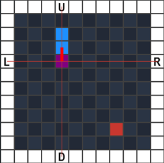
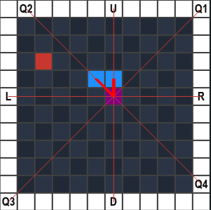

# SnakeML

## Dependencies
When using the executable it's not necessary to install the dependencies

Dependencies required to run the program using python:
1. numpy
2. pygame
3. pygame-gui
4. python3.10

To install the dependencies, run `pip3 install -r requirements.txt`

## Project Description
The Snake game is a classic arcade-style game where a player controls a snake that moves around a grid, aiming to eat food and grow longer. However, unlike traditional snake games, the movement of the snake is controlled by a neural network.

  

The neural network predicts the next move of the snake using as input a reduced vision of the game board. This reduced vision is implemented using "vision lines", lines that start at the head of the snake and go in different directions until they hit a wall. 

The vision lines can be drawn either using:

* 4 directions (UP, DOWN, LEFT, RIGHT) 

  

* 8 directions (UP, DOWN, LEFT, RIGHT + diagonal directions)

  

Each vision line stores 3 values: distance from head to wall, distance from head to apple and distance from head to the first body segment of the snake.
For the values for apple or body segment boolean values can also be used.

The neural network can be trained using 2 different methods:
1. Genetic algorithms: unsupervized, doesn't need help from the user to train the network

2. Backpropagation algorithm: supervized, needs training example obtained from the user for training the neural network

At the end of the training process using either training method, the trained neural network will be saved in a json file that can be used to test the performances of the network.

## Getting started

The project folder contains the executable of the project obtained using Pyinstaller.

At the starting menu the user can selected either to train a new neural network using genetic algorithms or backpropagation, or to test an existing neural network.

When the user selects a training method the program will show multiple windows that the user can use for selecting different options that will be used for training:
* starting snake size
* board size
* number of vision lines used

